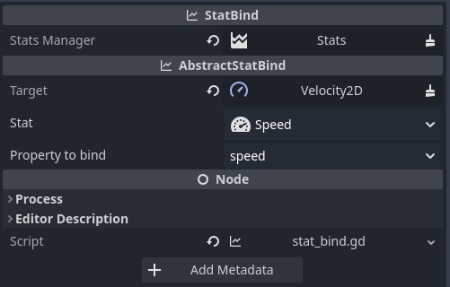
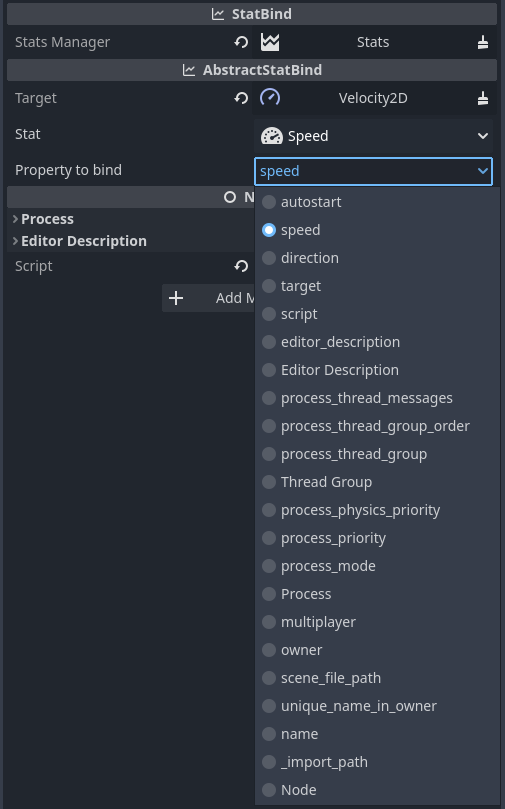

## Stat Binding: Dynamic Synchronization :link:

Stat binding allows for a seamless integration between your game logic and stats. The addon provides two types of stat binding nodes, `StatBind` and `StatValueBind`, that can be used to dynamically update the properties of other nodes based on your stats.

Both nodes share the same core functionality but differ in what they bind:

- **StatBind**: Binds the entire `Stat` object to a property.
- **StatValueBind**: Binds just the value of a `Stat` to a property.

---

### Configuring the StatBind :gear:

Before you can use either `StatBind` or `StatValueBind`, you need to configure the `StatBind` properly.

1. **Assign the StatsManager**: Link the `StatsManager` responsible for managing the stats you want to bind.
2. **Set the Target Node**: Identify which node's property will be bound to the stat.
3. **Set the Property to be Bound**: Specify which property of the target node you wish to bind to the stat.

### Stat Selection Dropdown :arrow_down_small:

After you've configured the `StatBind`, a dropdown menu will appear in the inspector, showing you all the stats that can be bound. Simply select the stat you wish to bind from this dropdown.

---

By making use of `StatBind` and `StatValueBind`, you can automate the updating of game elements based on stat changes, creating a more dynamic and reactive gameplay experience. :rocket: