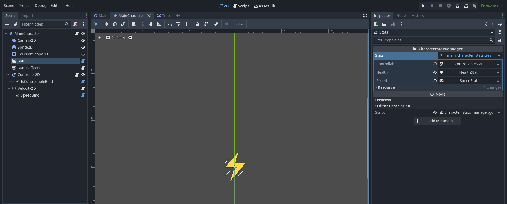

## Creating a Custom Stat :bulb:

Creating a custom stat is a straightforward process, allowing you to extend the functionality of the existing `Stat` class to suit your specific requirements. Below, we'll walk you through how to create your own stat class.

### Step 1: Inherit from the Existing `Stat` Class :bookmark:

To start, you'll want to inherit from a class that derives from the base `Stat` class provided by the Enhanced Stat addon. 
Create a new GDScript file for your custom stat. Make you sure you name your class via the **class_name** key word.
You will find a list of the classes you can inherit from in [Aggregated Stats](/manual/stats/aggragated.md), [Computed Stats](/manual/stats/computed.md). 

```gdscript
@icon("res://examples/icons/icons8-speed-24.png")
extends FloatStat
class_name SpeedStat
```

In the above example, I've crafted a simple FloatStat to store a numerical value representing the speed of my units. This stat is editable both in the editor and at runtime, providing flexibility for game development. To make it easily identifiable in the editor, I've also assigned it a unique icon.

### Step 2: Add the custom stat in a `Stats` container

```gdscript
@icon("res://examples/icons/icons8-running-24.png")
extends Stats
class_name CharacterStats

@export var speed: SpeedStat
```

I've established a resource container for my custom stat, which will act as a blueprint for all my units. This resource will be cloned at runtime for each individual unit instance. To enhance its visibility and quick identification within the editor, I've also associated it with a unique icon.

### Step 3: Add a `StatsManager` for the custom container

```gdscript
@tool
extends StatsManager
class_name CharacterStatsManager


func _ready() -> void:
	if Engine.is_editor_hint():
		return
	
	super()

func _get_property_list() -> Array:
	var result: Array = []

	result.append({ "name": "stats", "class_name": &"Resource", "type": 24, "hint": 17, "hint_string": "CharacterStats", "usage": 4102 })

	return result
```

Note that I'm using the "hint_string" property with the same **class_name** (CharacterStats) for the editor to recognize that I only want the `CharacterStatsManager` to display.

### Step 4: Create the `CharacterStatsManager` node in your units



You just need to configure it properly based on what you added earlier in your custom `Stats` class. All the code above is shared in the ***examples*** folder at the root of this project.