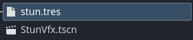
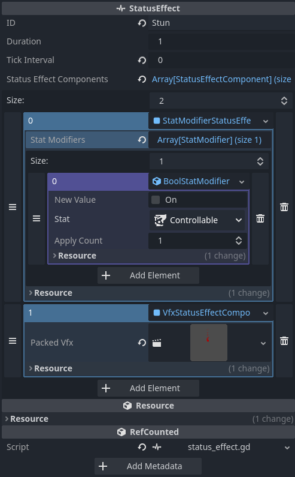
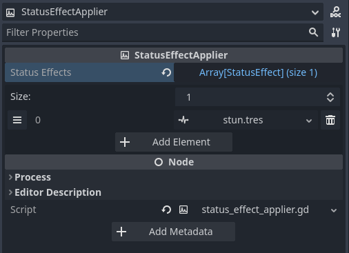

## Status Effects: Amplify Gameplay Dynamics :zap:

Status effects are temporary or long-lasting conditions that can alter game variables, player or enemy behavior, and more. With Enhanced Stat, implementing status effects becomes a highly manageable task. Our addon is designed to follow a component-based approach, making it incredibly versatile and reusable across your project.

---

### Core Concepts :book:

- **Status Effect**: The fundamental class representing a status effect. It contains multiple components that define its behavior.
  
- **Component**: Each individual functionality of a status effect is encapsulated in a component. For example, a 'Poison' status effect could have damage-over-time and slow-motion components.

---

### Creating a Status Effect :hammer_and_wrench:

To create a new status effect, you must create a new resource named after your status effect and inherit `StatusEffect`.



> I created the **stun.tres** and **StunVfx.tscn** as a PackedScene for vfxs of the status effect.

### Configuring a Status Effect :hammer_and_wrench:



> I've configured the `StatModifierStatusEffectComponent` with a `BoolStatModifier` inside to make the **IsControllable** stat to false once the stun effect kicks in. I've also configured a `VfxStatusEffectComponent` that instantiates a packed scene while the status effect is active.

### Applying and Managing Status Effects :control_knobs:

You can apply a status effect to an entity (which should have a `StatsManager` and a `StatusEffectManager`) using `StatusEffectApplier`:



Reference it and call the following method : **status_effect_applier.apply(target: Node)**
```gdscript
extends EnhancedArea2D
@onready var status_effect_applier: StatusEffectApplier = $StatusEffectApplier

func _ready() -> void:
	node_entered.connect(_on_node_entered)

func _on_node_entered(node: Node2D) -> void:
	status_effect_applier.apply(node)
```

### Reactive Gameplay :cyclone:

One of the powerful features of the Enhanced Stat addon is the reactivity of status effects. The `StatusEffect` class is designed to react automatically to changes in stats. For example, a 'Shield' status effect could automatically deactivate itself when the 'ShieldPower' stat reaches zero.

---

By integrating status effects into your game, you can add layers of complexity, making your game more engaging and interactive. Whether it's a short burst of speed, a complex poisoning effect, or a shield that reacts to in-game events, status effects are your go-to tool for dynamic gameplay. :star2: